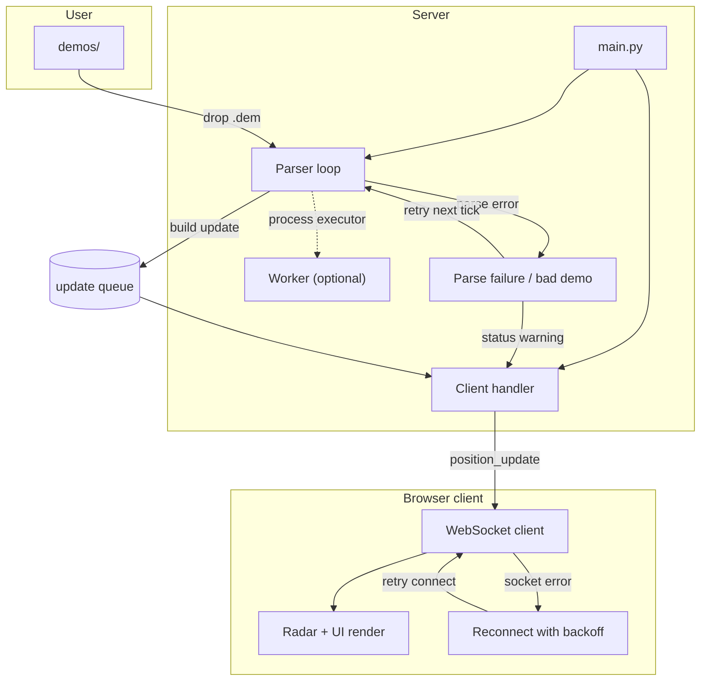
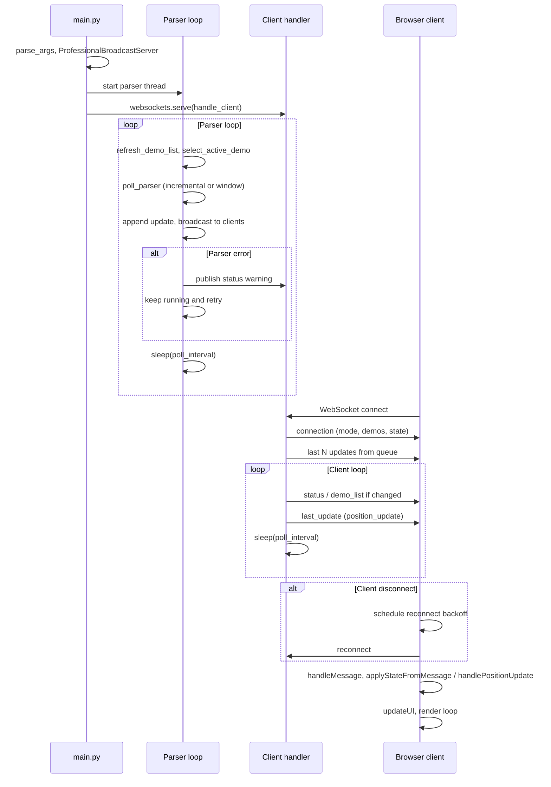

# CS2 Live Demo Parser

CS2 demo parser and WebSocket broadcaster for near real-time spectator overlays and match analysis.

Why: Provide low-latency, read-only demo telemetry for overlays without game memory access.

## Features
- Incremental demo parsing with automatic map detection
- Two modes: Live (tail newest demo file) and Manual (pick demo + playback controls)
- WebSocket streaming for multiple concurrent clients (JSON or MsgPack)
- MsgPack compression stats embedded at a configurable sampling interval
- Browser radar client with grid or overview textures + height layering
- Bomb position marker + bomb carrier indicator
- Map override control and bounds safety warnings when projection is risky
- Live lag tracking with automatic poll tuning down to a configurable floor
- demoparser2 backend from PyPI (friendly props like `X/Y/Z`, `yaw`, `health`)
- Read-only demo analysis (no game memory access)
- Optional map metadata from overview assets (see `maps/` in docs)

## Excluded features
Some functionality is intentionally kept out of this repository and excluded
from version control to reduce the risk of misuse as a cheat. Local-only
features should live under `private/` (and are ignored by `.gitignore`).

## How it works



The server runs two concurrent activities: a parser loop and an async client handler. The parser loop refreshes demos, selects the active file, polls the parser backend, and enqueues updates for broadcast. When parsing fails, the loop emits a status warning and retries on the next tick instead of stopping. The browser client applies each update to game state and reconnects with backoff on socket failures.

## Lifecycle



Startup begins in `main()`, which parses config, constructs `ProfessionalBroadcastServer`, and launches the parser thread plus WebSocket server. The parser loop runs continuously, and on parse errors it reports status and retries instead of tearing down the process. Each browser client receives a `connection` snapshot and then incremental updates (`position_update`, `status`, `demo_list`). If the socket drops, the client backs off and reconnects, then resumes normal rendering.

## Requirements
Python 3.13 and pip. Windows, macOS, or Linux.

## Getting started

### 1. Install

**macOS / Linux:**
```bash
python3 -m venv .venv
source .venv/bin/activate
pip install -r requirements.txt
```

**Windows (PowerShell):**
```powershell
python -m venv .venv
.venv\Scripts\activate
pip install -r requirements.txt
```

`requirements.txt` installs demoparser2 from PyPI (no local build needed).

### 2. Run the server

```bash
python server/main.py
```

By default the server binds to `127.0.0.1`. For remote access, pass `--bind-host 0.0.0.0`.

Optional: `--metrics-port 8766` for a JSON metrics endpoint at `http://127.0.0.1:8766/metrics` and a simple health check at `http://127.0.0.1:8766/health`.

### 3. Add demo files

Place `.dem` files in `demos/` (the server creates the folder on first run). The map is detected from the filename or demo header.

Examples: `demo_mirage.dem`, `match_dust2.dem`, `scrim_nuke.dem`.

Live mode follows the newest file in this folder. Manual mode lets you select a demo and use playback controls.

### 4. Open the client

Open `client/index.html` in your browser. The client defaults to `ws://localhost:8765` and can be overridden with `?ws=ws://host:8765`.

Example: `file:///.../client/index.html?ws=ws://127.0.0.1:8765`

### 5. First steps in the UI

1. Choose a Mode: **Live** (auto-selects newest demo) or **Manual** (pick a demo, then play/pause/seek/speed).
2. Optional: set a Map Override if detection is wrong.
3. Optional: adjust the MsgPack sampling interval (controls how often size stats refresh).
4. Watch the demo status and bounds safety badges for parsing readiness.

## Configuration

- **config.json** (root): server/client/parser settings.
- Optional local files (gitignored): `maps/map_definitions.json`, `maps/world_bounds.json`, `maps/overviews/` (see license for third-party assets).

Key server settings (config or env):
- `server.poll_interval` / `CS2_POLL_INTERVAL` (seconds)
- `server.min_poll_interval` / `CS2_MIN_POLL_INTERVAL` (auto-tuning floor)
- `server.msgpack_refresh_interval` / `CS2_MSGPACK_REFRESH_INTERVAL` (metrics sampling)
- `server.bind_host` / `CS2_BIND_HOST` (default `127.0.0.1`)
- `server.metrics_host` / `CS2_METRICS_HOST` (metrics bind address)

Common flags: `--demo-dir <path>`, `--poll-interval <sec>`, `--no-msgpack`, `--parser-executor none|thread|process`, `--metrics-port <port>`.

## Alternatives & Successors

> This project is archived. Consider these actively maintained alternatives:

| Project | Description | Link |
|---------|-------------|------|
| Leetify | AI-powered CS2 match analysis | [leetify.com](https://leetify.com) |
| SCOPE.GG | Live CS2 analysis and coaching | [scope.gg](https://scope.gg) |
| CS2 Demo Manager | Desktop demo analysis tool | [GitHub](https://github.com/akiver/cs-demo-manager) |
| HLTV.org | Professional match stats and live scores | [hltv.org](https://hltv.org) |

## Development (lint + tests)

```bash
pip install -r requirements.txt -r requirements-dev.txt
ruff check .
ruff format .
pytest -q
```

From repo root: **Install** `python -m venv .venv && source .venv/bin/activate && pip install -r requirements.txt -r requirements-dev.txt` · **Run** `python server/main.py` · **Test** `ruff format --check . && ruff check . && pytest -q` · **Full local CI** `./scripts/ci-local.sh` (optional: `RUN_PIP_AUDIT=1` or `RUN_GITLEAKS=1`).

See [MAINTENANCE.md](MAINTENANCE.md) for validation commands.

## Security
- Default bind host is `127.0.0.1`. To expose externally, set `--bind-host 0.0.0.0` (or `bind_host` in `config.json`) and consider network-level protections.
- CI includes secret scanning (gitleaks), SAST (CodeQL), and dependency scanning (pip-audit).

## Documentation
- `docs/PARSER_DOCUMENTATION.md` — Parser behavior and usage
- `docs/SECURITY_AND_ANTICHEAT_FAQ.md` — Security and anticheat FAQ
- `docs/VALVE_NOTICE.md` — Incremental demo reading risks and latency
- `docs/RUNBOOK.md` — Lint, test, CI, troubleshooting
- `docs/REPO_MAP.md` — Repository layout and entry points
- [MAINTENANCE.md](MAINTENANCE.md) — Maintenance and validation commands
- `SECURITY.md` — Security reporting guidance
- `CONTRIBUTING.md` — Development and contribution notes

## Repository layout
```
.
├── client/                 Browser client
├── server/                 Python WebSocket server
├── demos/                  Demo files directory (.gitkeep; .dem files gitignored)
├── docs/                   Documentation
├── scripts/                CI local reproduction (ci-local.sh)
└── tests/                  Pytest suite
```

## Optional local data (gitignored)
- `maps/` — You may provide `map_definitions.json`, `world_bounds.json`, `overviews/` (see docs; some assets may have separate licenses).

## License
MIT. See `LICENSE`.

## Troubleshooting
- No demos detected: place `.dem` files in `demos/` or pass `--demo-dir`.
- Client cannot connect: ensure the server is running and the WebSocket URL matches host/port.
- Tests fail to import server modules: run from repo root so `tests/conftest.py` can set `sys.path`.
