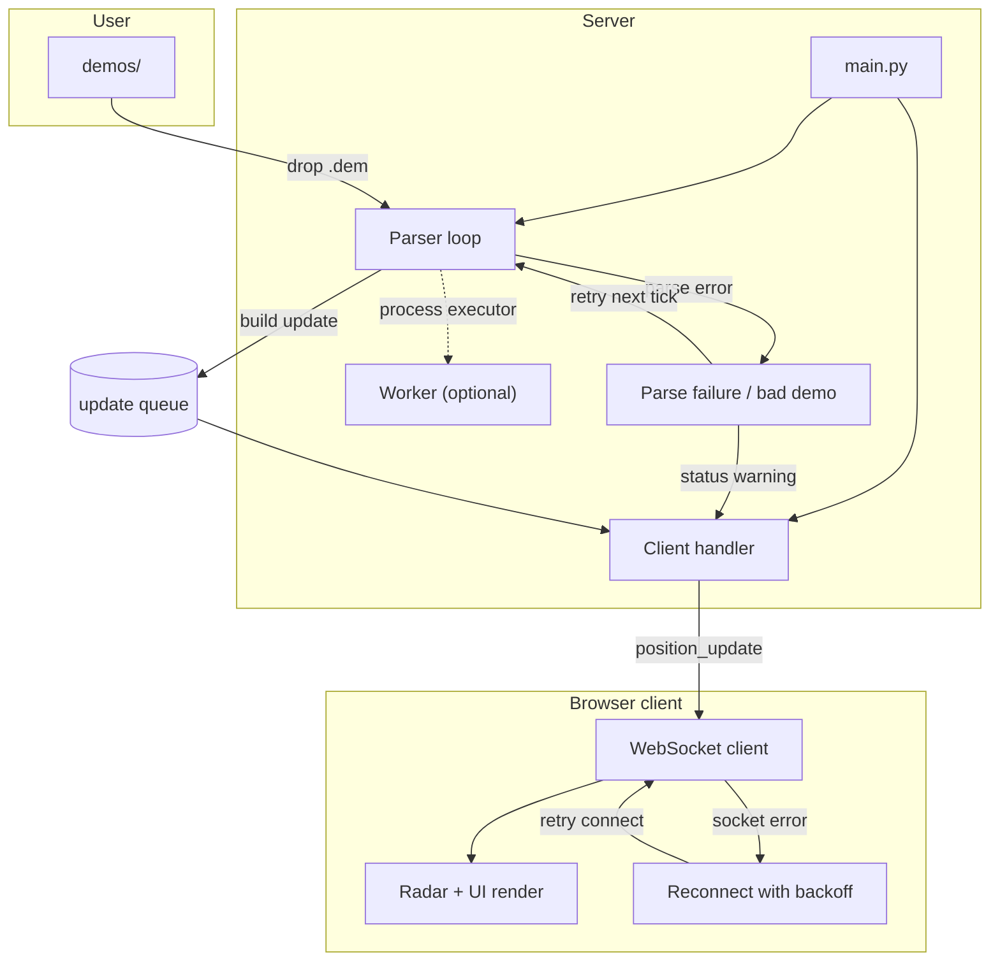
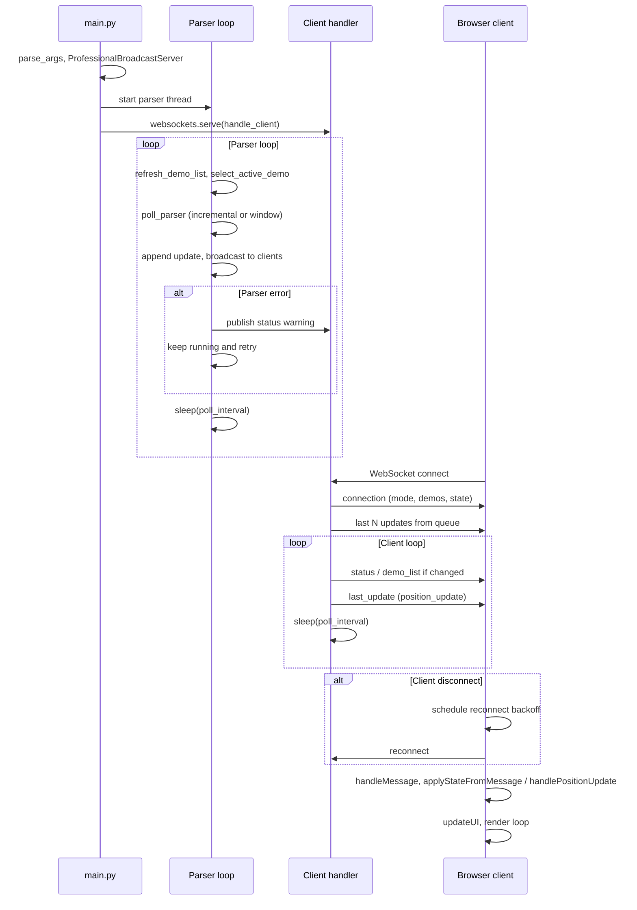

# CS2 Live Demo Parser

> **Archived project.** This repository is no longer actively maintained. See [Alternatives & Successors](#alternatives--successors) below for recommended tools.

Real-time CS2 demo parser and WebSocket broadcaster for esports overlays. Drop a `.dem` file in a folder, start the server, open the browser client, and get a live radar with player positions, economy, bomb status, and kill feed -- no game memory access required.

**Target audience:** Esports broadcasters, tournament observers, and competitive CS2 streamers who need a low-latency radar overlay running alongside their broadcast tools (OBS, vMix, etc.).

## Features
- Incremental demo parsing with automatic map detection
- Two modes: Live (tail newest demo file) and Manual (pick demo + playback controls)
- WebSocket streaming for multiple concurrent clients (JSON or MsgPack)
- MsgPack compression stats embedded at a configurable sampling interval
- Browser radar client with grid or overview textures + height layering
- Bomb position marker + bomb carrier indicator
- Map override control and bounds safety warnings when projection is risky
- Live lag tracking with automatic poll tuning down to a configurable floor
- demoparser2 backend from PyPI (friendly props like `X/Y/Z`, `yaw`, `health`)
- Read-only demo analysis (no game memory access)
- Optional map metadata from overview assets (see `maps/` in docs)

## Excluded features
Some functionality is intentionally kept out of this repository and excluded
from version control to reduce the risk of misuse as a cheat. Local-only
features should live under `private/` (and are ignored by `.gitignore`).

## How it works



The server runs two concurrent activities: a parser loop and an async client handler. The parser loop refreshes demos, selects the active file, polls the parser backend, and enqueues updates for broadcast. When parsing fails, the loop emits a status warning and retries on the next tick instead of stopping. The browser client applies each update to game state and reconnects with backoff on socket failures.

## Lifecycle



Startup begins in `main()`, which parses config, constructs `ProfessionalBroadcastServer`, and launches the parser thread plus WebSocket server. The parser loop runs continuously, and on parse errors it reports status and retries instead of tearing down the process. Each browser client receives a `connection` snapshot and then incremental updates (`position_update`, `status`, `demo_list`). If the socket drops, the client backs off and reconnects, then resumes normal rendering.

## Requirements
Python 3.13 and pip. Windows, macOS, or Linux.

## Getting started

### 1. Install

**macOS / Linux:**
```bash
python3 -m venv .venv
source .venv/bin/activate
pip install -r requirements.txt
```

**Windows (PowerShell):**
```powershell
python -m venv .venv
.venv\Scripts\activate
pip install -r requirements.txt
```

`requirements.txt` installs demoparser2 from PyPI (no local build needed).

### 2. Run the server

```bash
python server/main.py
```

By default the server binds to `127.0.0.1`. For remote access, pass `--bind-host 0.0.0.0`.

Optional: `--metrics-port 8766` for a JSON metrics endpoint at `http://127.0.0.1:8766/metrics` and a simple health check at `http://127.0.0.1:8766/health`.

### 3. Add demo files

Place `.dem` files in `demos/` (the server creates the folder on first run). The map is detected from the filename or demo header.

Examples: `demo_mirage.dem`, `match_dust2.dem`, `scrim_nuke.dem`.

Live mode follows the newest file in this folder. Manual mode lets you select a demo and use playback controls.

### 4. Open the client

Open `client/index.html` in your browser. The radar client connects to `ws://localhost:8765` by default.

To connect to a different host or port, append a query parameter:
```
client/index.html?ws=ws://192.168.1.50:8765
```

**OBS Browser Source:** Add `client/index.html?mini=1` as a Browser Source in OBS for a clean radar-only overlay without chrome.

### 5. First steps in the UI

1. **Check the connection indicator** in the header bar -- a green dot means the server link is live.
2. **Choose a mode:** *Live* auto-selects the newest demo; *Manual* lets you pick a demo and use playback controls (play/pause/seek/speed).
3. **Map override:** If auto-detection picks the wrong map, override it from the dropdown.
4. **Layout:** Switch to *Radar center* layout from the header for a broadcast-friendly view with team rosters flanking the map.
5. **Mini radar:** Click the "Mini radar" button to pop out a standalone radar window for a second monitor or OBS capture.

## Configuration

All settings live in `config.json` at the repository root. Every value can also be overridden with an environment variable or a CLI flag.

### config.json reference

```jsonc
{
  "server": {
    "bind_host": "127.0.0.1",   // Network interface to listen on. Use "0.0.0.0" for remote access.
    "demo_dir": "demos",        // Folder containing .dem files (relative to repo root or absolute).
    "poll_interval": 0.8,       // Seconds between parser ticks. Lower = fresher data, higher CPU.
    "min_poll_interval": 0.2,   // Floor for auto-tuned poll interval (live lag reduction).
    "use_msgpack": true,        // Use MsgPack encoding (smaller payloads). Set false for plain JSON.
    "parser_executor": "none",  // "none" (same thread), "thread", or "process".
    "msgpack_refresh_interval": 10, // Recompute compression stats every N messages.
    "metrics_port": 0,          // Set >0 to enable /metrics and /health HTTP endpoints.
    "metrics_host": "127.0.0.1" // Bind address for the metrics HTTP server.
  },
  "client": {
    "enable_trails": true,      // Draw position trails behind players on the radar.
    "enable_smoothing": true    // Interpolate player positions between updates.
  },
  "parser": {
    "tick_window": 256,         // Number of ticks to parse per poll cycle.
    "tick_window_min": 256,     // Minimum tick window (auto-tuning lower bound).
    "tick_window_max": 2048,    // Maximum tick window (auto-tuning upper bound).
    "event_parse_interval": 2.0 // Seconds between full event reparsing.
  }
}
```

### Environment variable overrides

| Setting | Env var | Example |
|---------|---------|---------|
| `server.bind_host` | `CS2_BIND_HOST` | `0.0.0.0` |
| `server.poll_interval` | `CS2_POLL_INTERVAL` | `0.5` |
| `server.min_poll_interval` | `CS2_MIN_POLL_INTERVAL` | `0.1` |
| `server.msgpack_refresh_interval` | `CS2_MSGPACK_REFRESH_INTERVAL` | `5` |
| `server.metrics_host` | `CS2_METRICS_HOST` | `0.0.0.0` |

### CLI flags

```
--demo-dir <path>              Override demo folder location
--poll-interval <seconds>      Override poll interval
--no-msgpack                   Disable MsgPack, send plain JSON
--parser-executor none|thread|process
--bind-host <address>          Override bind address
--metrics-port <port>          Enable metrics endpoint on this port
--metrics-host <address>       Override metrics bind address
```

### Optional local data (gitignored)

`maps/map_definitions.json`, `maps/world_bounds.json`, and `maps/overviews/` provide map geometry and overview images. These are gitignored because some assets may have separate licenses.

## Development (lint + tests)

```bash
pip install -r requirements.txt -r requirements-dev.txt
ruff check .
ruff format .
pytest -q
```

From repo root: **Install** `python -m venv .venv && source .venv/bin/activate && pip install -r requirements.txt -r requirements-dev.txt` · **Run** `python server/main.py` · **Test** `ruff format --check . && ruff check . && pytest -q` · **Full local CI** `./scripts/ci-local.sh` (optional: `RUN_PIP_AUDIT=1` or `RUN_GITLEAKS=1`).

See [MAINTENANCE.md](MAINTENANCE.md) for validation commands.

## Security
- Default bind host is `127.0.0.1`. To expose externally, set `--bind-host 0.0.0.0` (or `bind_host` in `config.json`) and consider network-level protections.
- CI includes secret scanning (gitleaks), SAST (CodeQL), and dependency scanning (pip-audit).

## Documentation
- `docs/PARSER_DOCUMENTATION.md` — Parser behavior and usage
- `docs/SECURITY_AND_ANTICHEAT_FAQ.md` — Security and anticheat FAQ
- `docs/VALVE_NOTICE.md` — Incremental demo reading risks and latency
- `docs/RUNBOOK.md` — Lint, test, CI, troubleshooting
- `docs/REPO_MAP.md` — Repository layout and entry points
- [MAINTENANCE.md](MAINTENANCE.md) — Maintenance and validation commands
- `SECURITY.md` — Security reporting guidance
- `CONTRIBUTING.md` — Development and contribution notes

## Repository layout
```
.
├── client/                 Browser client
├── server/                 Python WebSocket server
├── demos/                  Demo files directory (.gitkeep; .dem files gitignored)
├── docs/                   Documentation
├── scripts/                CI local reproduction (ci-local.sh)
└── tests/                  Pytest suite
```

## Alternatives & Successors

| Project | Description | Link |
|---------|-------------|------|
| Leetify | AI-powered CS2 match analysis | [leetify.com](https://leetify.com) |
| SCOPE.GG | Live CS2 analysis and coaching | [scope.gg](https://scope.gg) |
| CS2 Demo Manager | Desktop demo analysis tool | [GitHub](https://github.com/akiver/cs-demo-manager) |
| HLTV.org | Professional match stats and live scores | [hltv.org](https://hltv.org) |

## License
MIT. See `LICENSE`.

## Troubleshooting
- No demos detected: place `.dem` files in `demos/` or pass `--demo-dir`.
- Client cannot connect: ensure the server is running and the WebSocket URL matches host/port.
- Tests fail to import server modules: run from repo root so `tests/conftest.py` can set `sys.path`.
